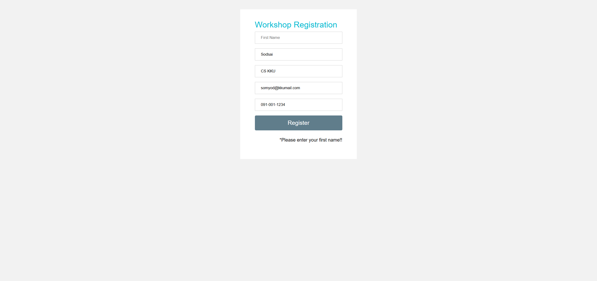
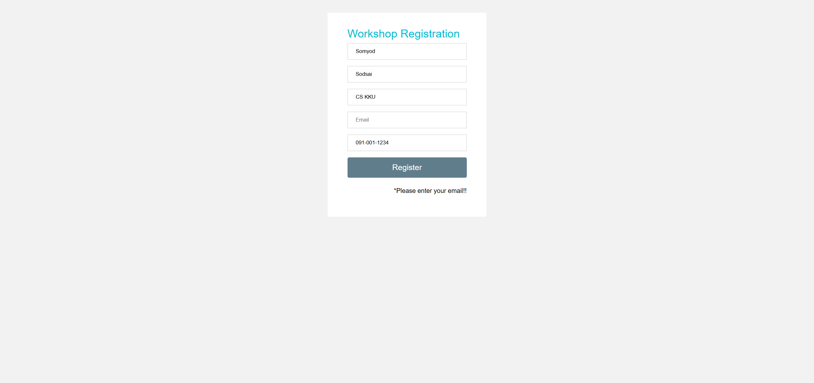

# ผลการทดสอบระบบลงทะเบียน LAB4

## 📋 ภาพรวมการทดสอบ

เอกสารนี้แสดงผลการทดสอบอัตโนมัติของระบบลงทะเบียนเข้าร่วม Workshop โดยใช้ Robot Framework ทดสอบทั้งหมด **8 Test Cases** ครอบคลุมทั้งกรณีที่ลงทะเบียนสำเร็จและกรณีที่มีข้อผิดพลาด

## ✅ สถิติการทดสอบ

| รายการ | จำนวน |
|--------|-------|
| **Test Cases ทั้งหมด** | 8 |
| **ผ่านการทดสอบ (Pass)** | 8 ✓ |
| **ไม่ผ่านการทดสอบ (Fail)** | 0 |
| **อัตราความสำเร็จ** | 100% |

---

## 🎯 รายละเอียดการทดสอบ

### Scenario 1: กรณีลงทะเบียนสำเร็จ (Success Cases)

#### TC01: Register Success (With Organization)
- **วัตถุประสงค์**: ทดสอบการลงทะเบียนสำเร็จเมื่อกรอกข้อมูลครบถ้วน
- **ข้อมูลทดสอบ**:
  - ชื่อ: Somyod
  - นามสกุล: Sodsai
  - หน่วยงาน: CS KKU
  - อีเมล: somyod@kkumail.com
  - เบอร์โทร: 091-001-1234
- **ผลลัพธ์**: ✅ **PASS** - แสดงข้อความ "Thank you for registering with us."

#### TC02: Register Success (No Organization)
- **วัตถุประสงค์**: ทดสอบการลงทะเบียนสำเร็จเมื่อไม่กรอกหน่วยงาน (ฟิลด์ Optional)
- **ข้อมูลทดสอบ**: เหมือน TC01 แต่ไม่กรอกหน่วยงาน
- **ผลลัพธ์**: ✅ **PASS** - ระบบยอมรับการลงทะเบียนโดยไม่ต้องกรอกหน่วยงาน

---

### Scenario 2: กรณีตรวจสอบความถูกต้องของข้อมูล (Validation Cases)

#### TC03: Empty First Name
- **วัตถุประสงค์**: ทดสอบการแจ้งเตือนเมื่อไม่กรอกชื่อ
- **ผลลัพธ์**: ✅ **PASS** - แสดงข้อความ "Please enter your first name!!"

#### TC04: Empty Last Name
- **วัตถุประสงค์**: ทดสอบการแจ้งเตือนเมื่อไม่กรอกนามสกุล
- **ผลลัพธ์**: ✅ **PASS** - แสดงข้อความ "Please enter your last name!!"

#### TC05: Empty First and Last Name
- **วัตถุประสงค์**: ทดสอบการแจ้งเตือนเมื่อไม่กรอกทั้งชื่อและนามสกุล
- **ผลลัพธ์**: ✅ **PASS** - แสดงข้อความ "Please enter your name!!"

#### TC06: Empty Email
- **วัตถุประสงค์**: ทดสอบการแจ้งเตือนเมื่อไม่กรอกอีเมล
- **ผลลัพธ์**: ✅ **PASS** - แสดงข้อความ "Please enter your email!!"

#### TC07: Empty Phone Number
- **วัตถุประสงค์**: ทดสอบการแจ้งเตือนเมื่อไม่กรอกเบอร์โทรศัพท์
- **ผลลัพธ์**: ✅ **PASS** - แสดงข้อความ "Please enter your phone number!!"

#### TC08: Invalid Phone Number
- **วัตถุประสงค์**: ทดสอบการตรวจสอบรูปแบบเบอร์โทรศัพท์ที่ไม่ถูกต้อง
- **ข้อมูลทดสอบ**: เบอร์โทร "1234" (ไม่ครบตามรูปแบบที่กำหนด)
- **ผลลัพธ์**: ✅ **PASS** - แสดงข้อความ "Please enter a valid phone number"

---

## 🔧 เครื่องมือและเทคโนโลยีที่ใช้

- **Test Framework**: Robot Framework 7.4.1
- **Browser Automation**: SeleniumLibrary
- **Browser**: Chrome (ChromeDriver)
- **Programming Language**: Python 3.10.11
- **Test URL**: http://localhost:7272/Registration.html

---

## 📊 สรุปผลการทดสอบ

### จุดเด่นของระบบ
✅ ระบบตรวจสอบความถูกต้องของข้อมูลได้ครบถ้วน  
✅ แสดงข้อความแจ้งเตือนที่ชัดเจนและเข้าใจง่าย  
✅ รองรับการกรอกข้อมูลแบบ Optional (หน่วยงาน)  
✅ ตรวจสอบรูปแบบเบอร์โทรศัพท์ได้อย่างถูกต้อง  

### ข้อมูลการทดสอบ
- **วันที่ทดสอบ**: ตามเวลาที่รัน Robot Framework
- **ผู้ทดสอบ**: นายธนัชชา คำไล้
- **สถานะ**: ✅ **ผ่านการทดสอบทั้งหมด 100%**

---

## 📁 ไฟล์ที่เกี่ยวข้อง

- `lab4.robot` - Test Script หลัก
- `report.html` - รายงานผลการทดสอบแบบละเอียด
- `log.html` - Log การทำงานของแต่ละ Test Case
- `TC*.png` - Screenshot ของแต่ละ Test Case
